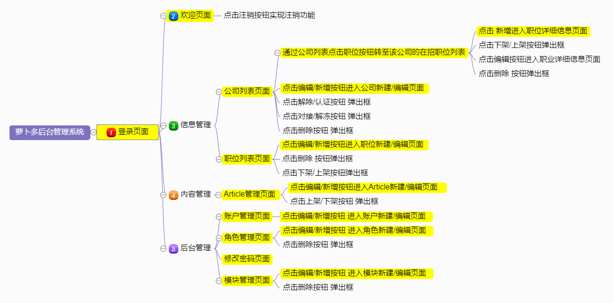
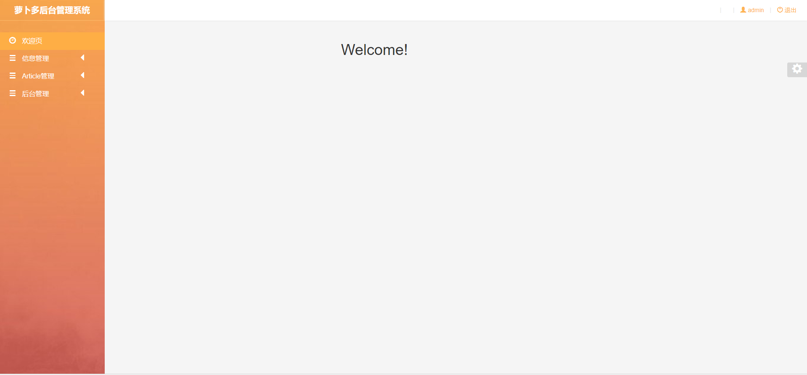
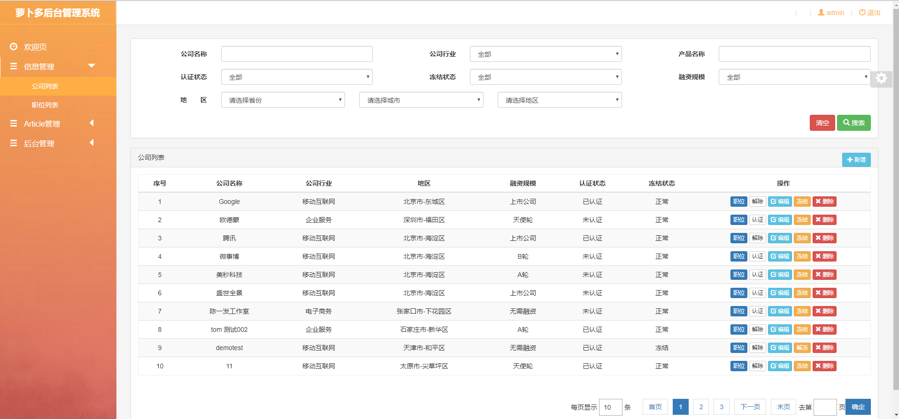
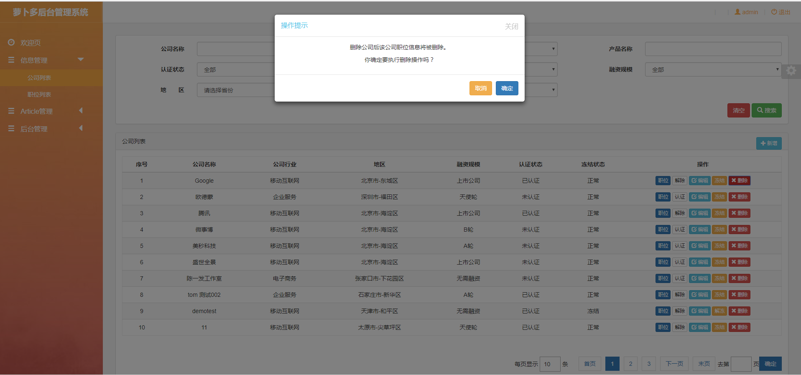
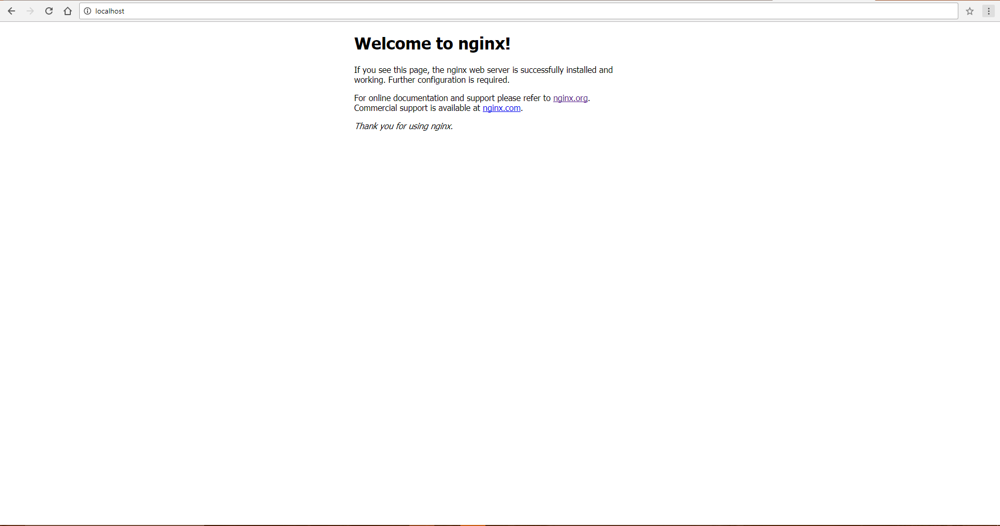

# 项目说明

基于AngularJS1.3.18 + BootStrap 3.3.7 + +jQuery3.2.1 的后台管理系统解决方案（萝卜多后台管理系统）。 "萝卜多"人才推荐----葡萄藤旗下的主要业务之一，为人才推荐公司，同时也能对人才进行分类以方便浏览。此项目可用来学习搭建整套网站的技术和流程。

以下是项目运行的详细说明，如果还有其他问题，请在 Issues 中提出，我会尽力解答。

 
## [Technology on websites](https://wappalyzer.com/)
- [x] AngularJS 1.3.18(JavaScript Framework)
- [x] Font Awesome(Font Script)
- [x] Nginx 1.13.4 (Web Server)
- [x] Twitter BootStrap(Web Framework)
- [x] jQuery 3.2.1(JavaScript Framework)
- [x] jQuery UI 1.12.1(JavaScript Framework)

## 实现功能
- [x] 登录/注销
- [x] 表格展示数据
- [x] 表单验证
- [x] UEditor富文本编辑器
- [x] 日期选择器
- [x] 图片上传
- [x] 支持切换主题/皮肤
- [ ] 列表拖拽排序

## 目录结构

```
|-- css                              // CSS样式目录
|   |-- skin                         // 皮肤文件目录
|       |-- darkblue.css             // 深蓝色皮肤样式
|       |-- oranger.css              // 橙色皮肤样式
|   |-- base.css                     // 基础样式
|   |-- public.css                   // 公共样式
|-- images                           // 图片文件目录
|-- js                               // JS文件目录
|   |-- constant                     // 常量目录
|   |-- controller                   // 控制器目录
|   |-- directives                   // 自定义指令目录
|   |-- factory                      // 工厂目录
|   |-- filter                       // 过滤器目录
|    |-- server                      // 请求地址与方式目录
|   |-- config.js                    // 统一配置
|   |-- router.js                    // 路由
|-- vendor                           // 富文本编辑器
|-- view                             // HTML文件目录
|   |-- admin                        // 登录页面
|   |-- BackstageManagement          // 后台管理    
|   |-- ContentManagement            // 内容管理    
|   |-- InformationManagement        // 信息管理    
|   |-- template                     // 弹出框HTML文件
|   |-- dashboard.html               // 欢迎页面
|   |-- template                     // 后台页面                        
|-- 404.html                         // 404页面
|-- index.html                       // 入口html文件
|-- nginx.conf                       // nginx配置文件
|-- README.md                        // 项目介绍
```

## 页面逻辑图


[最新版本百度脑图在线地址](http://naotu.baidu.com/file/42bbc924aa4f4e49cfd218a49ea67ba3?token=1e7a9e3c31400cf3)

## 项目截图

- 登录页面

~~~~

- 欢迎页面

- 信息管理

- 模态框


- 富文本编辑器和图片上传


## 在线运行此项目?
[系统在线运行地址](http://student.admin.carrots.ptteng.com/Dangal/index.html#/login)

账号:admin

密码:123456

## 本地运行项目

### 0. 先将项目clone 到你的电脑本地

### 1. [nginx 官网](https://nginx.org/en/download.html)下载 nginx


点击[下载 nginx](https://nginx.org/download/nginx-1.13.1.zip) 直接下载之后 解压到相应的目录了，不用安装就可以直接用了，文件夹名字命为 `nginx`

### 2. 测试`nginx`是否能成功启动

打开之前存储解压之后的`nginx`文件夹，双击`nginx.exe` ，这是你会发现有个黑色弹出框一闪即逝；这说明它启动了；

然后随便打开一个浏览器(推荐使用 `Chrome` )；在地址栏输入`localhost`出现下图；恭喜你安装成功了；


> nginx 的作用

> 本地文件是不能直接向测试或线上服务器发送请求的，`nginx`可以帮你实现。 nginx的作用简单的说，就是通过设置路径，你输入一个`localhost`，你访问的是你的本地文件，但这个本地文件可以向测试或线上服务器发送请求。

> 更多的`nginx`作用请 [Google](https://www.google.com/search?q=nginx%E7%9A%84%E4%BD%9C%E7%94%A8&oq=nginx%E7%9A%84%E4%BD%9C%E7%94%A8&aqs=chrome..69i57.713j0j4&sourceid=chrome&ie=UTF-8#newwindow=1&q=nginx%E4%BD%9C%E7%94%A8)

> 怎样关闭`nginx`呢？因为你看不到它执行的文件，只能从任务管理器里关，但这显然是个麻烦而糟糕的办法。更好的办法，请参考下文的`nginx`使用技巧和常用命令。

### 3. `nginx`安装

`nginx`的安装非常简单，只需到其 [官网](http://nginx.org/) 下载，这是一个压缩包文件，把它解压到自定义文件夹即可，如`E:\nginx-1.13.4`(安装路径下禁止中文)。

打开文件夹，第一层文件目录里就有一个`nginx.exe`文件，双击打开，一个黑框一闪而过，任务管理器里有`nginx.exe`的进程。然后打开一个浏览器，访问`localhost`，如果出现`nginx`的欢迎界面，表示你的`nginx`已经安装成功。



### 4. 配置Nginx的配置文件

conf文件夹下的nginx.conf就是配置文件，你通过浏览器输入`localhost`出现的页面即为文件夹 `nginx`下`html`文件中的`index.html`；所以你可以将你想要检测的项目代码放到`html`文件夹中，并将原本的index.html文件给删了，这个时候打开网页输入localhost，使用ctrl+F5清下浏览器缓存即出现你产品中的index.html(项目代码的首页一般会命名为index.html）页面，然后进行一系列测试看看其他功能是否实现。

- nginx的本地配置

目标：通过在浏览器输入域名，访问本地文件

举例：在浏览器里输入`localhost`,访问本地`E:\nginx-1.13.1\html\index.html`文件(前提是这里自己先按路径写个测试用的html文件)

步骤：用记事本(其他文本编辑器`Atom`或者`Sublime`)打开你的`E:\nginx-1.13.1\conf\nginx.conf`文件。文件中有很多前面带#的代码代表该行是注释,可以忽略。

找到下面这段代码：

```bash
 server {
    listen       80;
    server_name  localhost;
    location / {
        root   html;
        index  index.html index.htm;
    }
 }
```

这段代码的作用就是在配置本地服务器，在浏览器中输入`localhost`，可以默认访问的根目录是`nginx`的安装文件夹之下的文件夹`html`。初始状态的时候默认访问的文件是`nginx`的安装文件夹之下的文件夹`html`之下的`index.html`文件(`nginx`的欢迎界面)。这就是为什么我们配置成功后能打开那个页面了。

简单的理解是这样的，你在浏览器输入server_name对应的localhost就是你的主机，你的浏览器将跳转到配置文件中`html 文件(root)之下是我index.html 文件(index)` 。 所以你要实现访问本地文件中其他文件，只需把`root`设置为该文件所在文件夹路径，`index`设置为该文件的文件名，然后重启nginx个可以实现。

- nginx的跨域配置 目标：通过在浏览器输入域名，访问本地文件，向测试(或线上)环境的服务器发送请求

举例：通过在浏览器输入`localhost`,访问本地文件，向测试服务器( <http://dev.admin.carrots.ptteng.com/)提供的获取用户总数的接口发送请求。>

步骤：在原来的基础上配置location /carrots-admin-ajax/。加上如下location /carrots-admin-ajax/{}部分代码。参数其实就一个，proxy_pass配置为要访问的服务器的IP和端口号(没写的话是默认的8080)。其余的几行是固定的设置。

```
 server {
    listen       80;
    server_name  localhost;
    location / {
        root   html;
        index  index.html index.htm;
    }
    location /carrots-admin-ajax/ {
        proxy_pass http://dev.admin.carrots.ptteng.com/;
    }
 }
```

这段代码的作用可以认为是，调用接口时，用到/carrots-admin-ajax/的部分将被替换为<http://dev.admin.carrots.ptteng.com/。>

### 5. 修改配置文件

上面说到配置可以不修改，但在实际的测试过程中，一般不大可能会将产品往nginx文件里的html文件夹中塞，这个时候咱们就得改下配置了；请打开`nginx`文件夹下的`conf`文件夹，里面有个`nginx.conf`文件，用文本编辑器 (Atom, Sublime或者微软自带的文本编辑器)打开它。

当你不修改配置文件时，`localhost` 默认显示的是`nginx`目录之下的`html`文件夹之下是`index.html`文件 配置文件 `nginx.conf`中`root html;`(代表文件夹`nginx`下的`html`文件夹)； `index index.html index.htm`(代表文件夹`nginx`下的`html`文件夹的`index.html`或者`index.htm`); ，要将它改成你想要检测的产品的路径(也可不修改,将你想要检测的产品的全部文件复制到默认网站根目录为`../nginx/html`中)。

将配置文件`../nginx/conf/nginx.conf`其中的

```
location /
{
    #root：里面配置了root，表示当匹配这个请求的路径时，将会在这个文件夹内寻找相应的文件，这里对我们之后的静态文件伺服很有用。
    root html;
    # index：当没有指定主页时，默认会选择这个指定的文件，它可以有多个，并按顺序来加载，如果第一个不存在，则找第二个，依此类推。
    index index.html index.htm;
}
```

改为

```
location /
{
    #root：里面配置了root，表示当匹配这个请求的路径时，将会在这个文件夹内寻找相应的文件，这里对我们之后的静态文件伺服很有用。
    root html; # 将 html 修改为你测试产品文件的文件夹(我一般不修改)
    # index：当没有指定主页时，默认会选择这个指定的文件，它可以有多个，并按顺序来加载，如果第一个不存在，则找第二个，依此类推。
    index index.html index.htm; # 将 index.html 修改为你测试产品文件的文件夹首页文件名(我一般不修改)
}
```

然后重启nginx。

### 6. nginx使用技巧和常用命令

因为nginx在使用时要经常重启，所以最好在命令行使用nginx，效率比在任务管理器里找到进程关闭，然后再双击打开高很多。

你只需要记住几个命令即可：

- 开启nginx命令：start nginx
- 重启命令：nginx -s reload( 修改nginx配置文件后重新启动nginx服务 )
- 关闭命令：nginx -s stop

### 7.完整的nginx配置文件在项目中的nginx.conf 文件，可以直接替换你的nginx 配置文件
